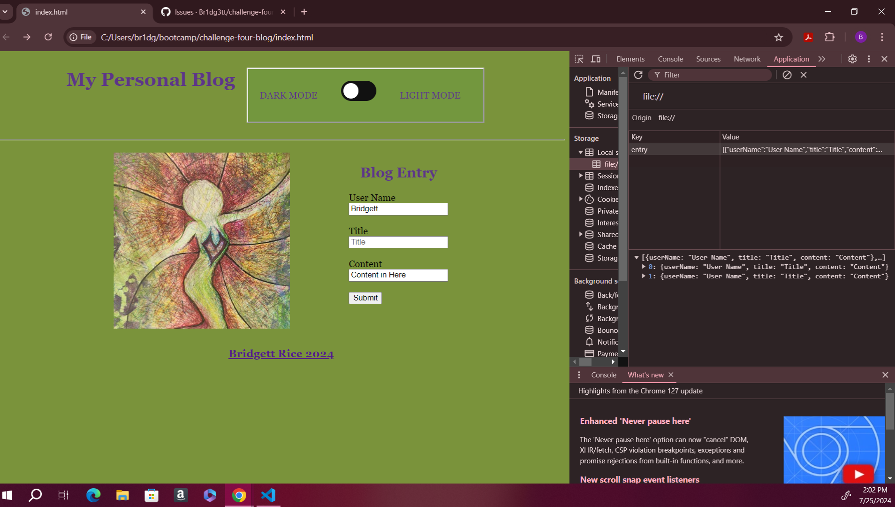

## Challenge Four Blog

## Description

On this website you will find a blog landing page in which a user can add individual blog entries and then are redirected to a second page where each submitted entry can be viewed.  The forms to enter information in include a username form, a title form, and a content form.  The website also includes a dark and light mode toggle as well as a footer with a link.

## Installation

N/A

## Usage

When the website is opened, the landing page will have three forms to enter a username, title, and content for each individual entry.  If any of the forms are left black, the user is prompted to fill out the missing information.  After an entry is filled out, the users information is stored in localStorage and they are redirected to the blog entries webpage that shows each individual entry added.  The user is able to add and view multiple entries.  There is also a back button provided on the blog entries page to take the user back to the landing page.  Both pages contain a light and dark mode toggle button that changes the background and text colors for each individual mode when clicked.  Finally, the link about the bottom footer takes the user to my work portfolio webpage.

Website Link: https://br1dg3tt.github.io/challenge-four-blog/

## Credits

Coding Classmates, Tutor, Class T.A. and Instructor

## License

MIT

## Badges

N/A

## Features

N/A

## How to Contribute

N/A

## Tests

N/A